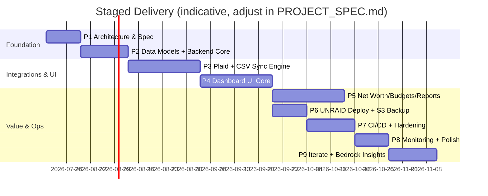
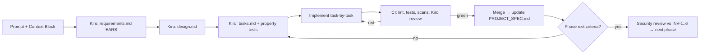

# ENGINEERING BUILD GUIDE — The Sorcerer's Stone
**Audience:** Kiro IDE + cloud engineering team
**Method:** Spec-driven. Every phase = (1) Kiro spec session → (2) task execution → (3) tests green → (4) PROJECT_SPEC.md updated → (5) security review vs. invariants INV-1..INV-6.

The roadmap and full requirement/architecture detail live in `PHASE1_ARCHITECTURE_SPEC.md`; this document is the execution playbook.

---

## Roadmap at a Glance





---

## Phase 0 — Prerequisites (once)
1. Create private GitHub repo `sorcerers-stone`; enable branch protection on `main` (PR + green CI required), Dependabot, secret scanning.
2. Repo layout:
   ```
   /app            # FastAPI application package
   /specs          # Kiro-generated requirements/design/tasks
   /infra          # compose, Caddyfile, terraform (optional), backup image
   /docs           # ARCHITECTURE.md, SECURITY.md, runbooks
   PROJECT_SPEC.md
   PHASE1_ARCHITECTURE_SPEC.md
   ```
3. Commit the four scaffold artifacts from this delivery (spec, PROJECT_SPEC, compose, CI).
4. UNRAID: create encrypted share `appdata/sorcerers-stone`; place stack on the services VLAN; OPNsense rules: container egress → Plaid endpoints, AWS S3 endpoints, DNS only; **no WAN port-forward** — access via WireGuard.
5. AWS (scoped account/role): one S3 bucket, Block Public Access ON, bucket policy denying non-TLS and non-encrypted puts, lifecycle Standard→IA(30d)→Glacier(180d), versioning ON; IAM user with `s3:PutObject/GetObject/ListBucket` on `sorcerers-stone/*` prefix only. Record ARNs in PROJECT_SPEC §10.
6. Plaid: create developer account, generate **Sandbox** keys; store as Docker secrets, never in `.env` committed files.
7. Generate secrets: `openssl rand -base64 32` for app/session/field keys; `age-keygen` pair (private key stored offline — password manager + printed escrow).

## Phase 1 — Architecture & Core Spec
1. Open Kiro session; paste framework §3 Always-Included Context + this repo's PHASE1 spec.
2. Prompt Kiro to expand §1 EARS into full `specs/requirements.md` (target: every dashboard feature in §4 API table has ≥1 requirement; every requirement testable).
3. Prompt Kiro for `specs/design.md` refining §2–§5 (component boundaries, connector Protocol, crypto module design: AES-256-GCM wrapper with key from `/run/secrets/field_enc_key`, nonce-per-record, AAD = record ID).
4. Prompt Kiro for `specs/tasks.md` covering Phase 2, with dependencies and property-test stubs.
5. Execute tasks 1.6–1.8 from PHASE1 spec (compose scaffold up, CI green, S3 verified with a test `age`-encrypted object round-trip).
6. **Exit review:** threat model walkthrough; all six invariants have an enforcing control in design.md; sign off in decision log.

## Phase 2 — Data Models, Schema, Backend Core
1. Implement SQLAlchemy 2.0 (async) models per ERD; Alembic migrations from commit one.
2. Crypto module first, TDD: encrypt/decrypt round-trip property tests (Hypothesis: arbitrary bytes, tamper detection on AAD/nonce/ciphertext mutation must raise).
3. FastAPI skeleton: app factory, settings via Pydantic Settings reading `_FILE` secret paths, structured JSON logging (no PII in logs — enforce with a log-scrub test), `/healthz`, `/metrics`.
4. Auth: single user, Argon2id hash, server-side sessions in Redis, CSRF on state-changing routes, rate limit per REQ-N2.
5. Audit log module: append-only table; DB role for app has no UPDATE/DELETE grant on it (migration enforces).
6. **Exit:** `pytest` ≥80% coverage on core, migrations apply cleanly to fresh Postgres, authenticated "hello dashboard" page served through Caddy TLS on LAN.

## Phase 3 — Secure Integrations Layer
1. Define `Connector` Protocol + registry (entry-point style plugin discovery).
2. **Plaid connector:** Link token flow (`/link/plaid/token`, `/link/plaid/exchange`); store access_token via crypto module only; `transactions/sync` cursor-based incremental sync; Investments + Liabilities pulls; item error-state handling per REQ-E4; webhook receiver optional (LAN-only → defer, poll instead).
3. **CSV/OFX connector:** streaming parser, strict Pydantic row models, formula-injection sanitization (`=`, `+`, `-`, `@` prefixes), dedupe on (account, external_id | hash(date, amount, normalized merchant)).
4. Sync engine in worker container: APScheduler jobs per connector item, jittered schedules, per-item circuit breaker, quarantine table per REQ-N1, audit entry per sync.
5. Property tests (Kiro): parser never crashes on arbitrary input; sync idempotency; dedupe stability under reordering.
6. **Exit:** Plaid **Sandbox** items sync end-to-end into canonical tables; malformed CSV corpus fully quarantined; zero plaintext tokens in DB dump (CI grep test against a seeded test DB).

## Phase 4 — Dashboard UI Core
1. Jinja2 + Tailwind + HTMX partials; base layout with dark mode, WCAG AA contrast, keyboard nav.
2. Views: Overview (net worth headline + 90-day sparkline), Accounts (grouped by type, staleness indicators), Transactions (server-side filter/paginate/search, category edit), Investments (holdings, allocation donut, cost basis vs. market).
3. Chart.js via server-provided JSON endpoints; no third-party CDNs — vendor static assets locally (privacy: zero external calls from browser).
4. Playwright E2E happy paths in CI.
5. **Exit:** all four views usable on mobile over WireGuard; Lighthouse a11y ≥ 90.

## Phase 5 — Advanced Features
1. Net worth engine: daily balance snapshots + manual asset valuations (vehicles/property) → time-series with contribution breakdown.
2. Budgets & goals: category budgets, month-over-month, goal progress vs. targets.
3. Reports & export: monthly summary; `/export` full-fidelity JSON/CSV bundle (GDPR-style portability, REQ mapped).
4. **Exit:** net worth reconciles against a manually verified spreadsheet baseline for one full month of data.

## Phase 6 — Infrastructure & Backup Lane
1. Harden compose per scaffold (read-only rootfs, cap_drop, non-root) — verify each with `docker inspect` checks scripted in CI.
2. Backup container: nightly `pg_dump -Fc | age -R /run/secrets/age_recipient | aws s3 cp - s3://…/$(date +%F).dump.age`; SHA-256 sidecar; retention via S3 lifecycle.
3. **Restore-verify job (weekly):** pull latest object → decrypt → restore into throwaway Postgres container → row-count + checksum assertions → alert on failure (a backup is not a backup until restore is proven).
4. **Exit:** timed full restore < 2h RTO documented as a runbook.

## Phase 7 — CI/CD & Hardening
1. Extend CI: coverage gate, Trivy, pip-audit, gitleaks (already scaffolded); add ZAP baseline scan against compose stack in a nightly workflow.
2. Wire Kiro CLI headless review as PR advisory job; promote to required once stable.
3. Release flow: tag → build/push GHCR image → UNRAID pull script (`compose pull && up -d`) via SSH action or manual runbook (choose per comfort with CI holding SSH keys; manual is acceptable and safer initially).
4. Hardening pass: dependency pinning with hashes (`pip-compile --generate-hashes`), CSP + security headers at Caddy, session hardening review, secrets rotation runbook + rehearsal.
5. **Exit:** clean ZAP baseline (no High), all gates required on `main`.

## Phase 8 — Monitoring & Polish
1. Prometheus metrics: sync success/failure counters, item staleness gauge, backup age gauge, HTTP latencies; Grafana dashboard on existing home stack; alerts: backup age > 26h, item error > 24h, auth failure spike.
2. Log review: confirm zero PII/token material in logs (automated scrub test in CI).
3. UX polish sprint from real usage notes.
4. **Exit:** one-page ops dashboard; alerting verified by fault injection (kill backup job, break a sandbox item).

## Phase 9 — Iterate & Extend
1. 30-day daily-driver period; capture issues in repo.
2. Optional Bedrock insights per REQ-O1: batch job computes **aggregates only** (category totals, trends) → Converse API for narrative insights; evaluate local Ollama first as the privacy-preferred path.
3. Extensibility spikes: GoCardless connector, household read-only login.

---

## Standing Rules for Every PR
- [ ] Spec reference in description (`specs/tasks.md#…`)
- [ ] Tests included (unit + property where parsing/crypto/dedupe touched)
- [ ] No secrets, no PII in code/tests/fixtures (synthetic data only)
- [ ] Invariant impact statement (INV-1..6: none / which / how mitigated)
- [ ] PROJECT_SPEC.md decision log updated if any decision changed
