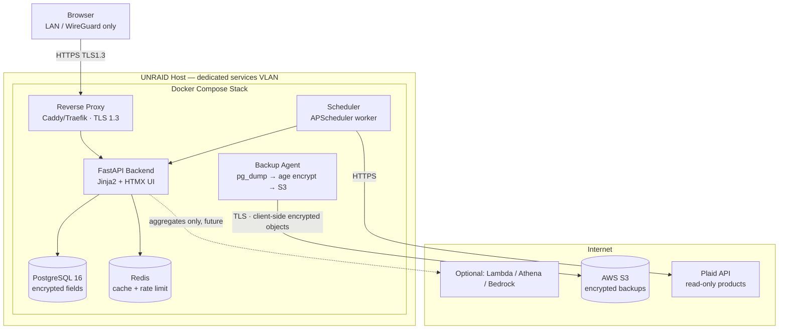
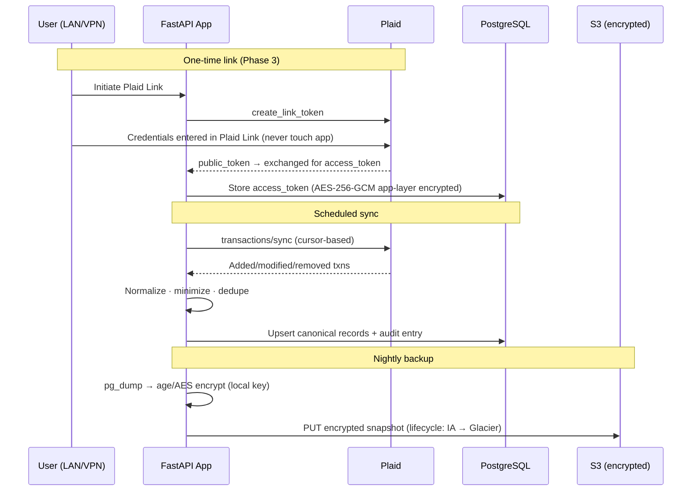
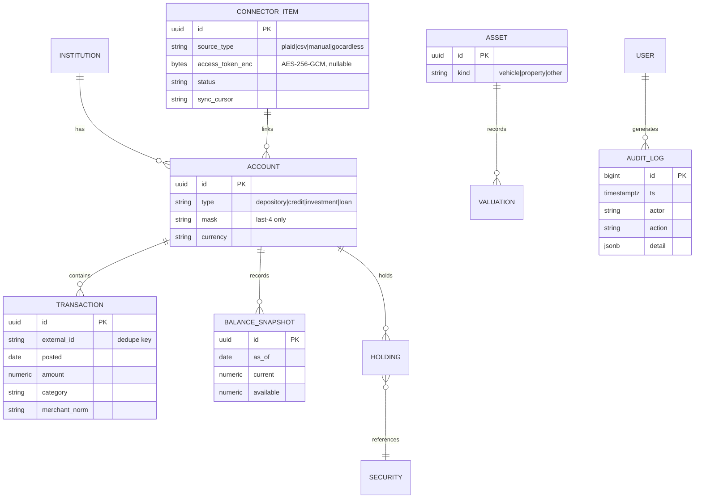

# The Sorcerer's Stone — Phase 1 High-Level Architecture Specification

**Project:** Secure Financial Central Planner Dashboard
**Owner:** Obsidian Forged Systems LLC (OFS)
**Phase:** 1 — Requirements, High-Level Architecture & Core Spec
**Status:** DRAFT v0.1 — for Kiro ingestion
**Classification:** Personal / OFS Internal

---

## 0. Threat Model & Security Posture (Read First)

Every downstream decision in this spec derives from the following threat model.

### 0.1 Assets to Protect
| Asset | Sensitivity | Notes |
|---|---|---|
| Plaid access tokens / item IDs | CRITICAL | Grants read access to linked financial institutions |
| Transaction & balance history | HIGH | Full financial behavioral profile |
| Account metadata (institution, masked numbers) | HIGH | Enables social engineering if leaked |
| Net worth / asset valuations | HIGH | Personal financial position |
| App session credentials | HIGH | Gateway to all of the above |
| AWS credentials (backup lane) | HIGH | Cloud blast radius |
| Manual CSV/OFX imports at rest | HIGH | Same data, unmanaged format |

### 0.2 Threat Actors & Vectors
1. **External network attacker** — internet-facing exposure, credential stuffing, TLS downgrade. *Mitigation: no direct WAN exposure; LAN/VPN (WireGuard/Tailscale) access only; TLS 1.3 internally via reverse proxy.*
2. **Compromised container / supply chain** — malicious dependency, container escape. *Mitigation: pinned dependencies, SBOM + scanning in CI (pip-audit, Trivy), non-root containers, read-only rootfs where possible, network-segmented Docker bridge on a dedicated VLAN.*
3. **Cloud-side exposure** — S3 misconfiguration, IAM over-permissioning. *Mitigation: client-side encryption BEFORE upload (age or KMS envelope), S3 Block Public Access, bucket policy deny non-TLS, least-privilege IAM user scoped to one bucket prefix, no plaintext financial data ever leaves UNRAID.*
4. **Local host compromise (UNRAID)** — array access, Docker socket abuse. *Mitigation: Docker secrets, encrypted DB fields for tokens (Fernet/AES-256-GCM via app-layer key), no Docker socket mounts, appdata on encrypted share.*
5. **Insider/household access** — shared physical network. *Mitigation: app authentication (single-user initially, session-hardened), VLAN isolation consistent with existing Galactic Network Command segmentation, audit logging of all data access.*
6. **Third-party aggregator risk (Plaid)** — token misuse, breach at aggregator. *Mitigation: read-only products only (Transactions, Investments, Liabilities, Balance); no Auth/payment products; token rotation support; per-item revocation runbook.*

### 0.3 Security Invariants (Non-Negotiable)
- **INV-1:** Plaintext financial data never leaves the UNRAID host. Cloud copies are client-side encrypted before transit.
- **INV-2:** No raw bank credentials are ever seen or stored by the app — Plaid Link handles credential exchange.
- **INV-3:** Access tokens stored only as app-layer encrypted fields (AES-256-GCM), key sourced from Docker secret, never in env vars committed anywhere.
- **INV-4:** All external ingress requires authenticated session + TLS 1.3; default deployment is LAN/VPN-only.
- **INV-5:** Every read/sync of financial data emits an immutable audit log entry.
- **INV-6:** Data minimization — store only fields required by an implemented feature; drop the rest at ingest.

---

## 1. Requirements (EARS Notation)

### 1.1 Ubiquitous
- **REQ-U1:** The system shall encrypt all sensitive data at rest using AES-256 and all data in transit using TLS 1.3.
- **REQ-U2:** The system shall write an audit log entry for every data sync, data export, and authenticated data access.
- **REQ-U3:** The system shall run entirely on the UNRAID Docker host, with AWS used only for encrypted backup and optional burst services.
- **REQ-U4:** The system shall store secrets exclusively via Docker secrets or an encrypted secrets store, never in source control or plaintext environment files.

### 1.2 Event-Driven
- **REQ-E1:** WHEN a scheduled sync interval elapses, the system shall retrieve new transactions and balances from each active connector and persist normalized records.
- **REQ-E2:** WHEN a user uploads a CSV or OFX file, the system shall validate, parse, deduplicate, and import the records into the canonical transaction store.
- **REQ-E3:** WHEN a nightly backup window opens, the system shall produce an encrypted database snapshot and upload it to the designated S3 bucket prefix.
- **REQ-E4:** WHEN a Plaid item enters an error state (e.g., ITEM_LOGIN_REQUIRED), the system shall flag the connection in the dashboard and suppress further sync attempts until re-authenticated.

### 1.3 State-Driven
- **REQ-S1:** WHILE a user session is unauthenticated, the system shall serve only the login endpoint and static assets.
- **REQ-S2:** WHILE the AWS backup lane is unreachable, the system shall continue full local operation and queue backup jobs for retry with exponential backoff.

### 1.4 Unwanted-Behavior
- **REQ-N1:** IF a connector returns malformed data, THEN the system shall quarantine the payload, log the event, and continue processing remaining connectors.
- **REQ-N2:** IF authentication fails 5 times within 15 minutes from one source, THEN the system shall rate-limit that source for 30 minutes and log the event.
- **REQ-N3:** IF a backup object fails integrity verification (checksum mismatch), THEN the system shall alert and retain the previous verified snapshot.

### 1.5 Optional/Future
- **REQ-O1:** WHERE Bedrock insights are enabled, the system shall transmit only aggregated, de-identified summaries — never raw transactions — to the cloud inference endpoint.

---

## 2. Architecture Overview

### 2.1 System Context



### 2.2 Data Flow



### 2.3 Hybrid Boundary
| Concern | UNRAID (authoritative) | AWS (supporting) |
|---|---|---|
| App, UI, API | ✅ | — |
| PostgreSQL (system of record) | ✅ | — |
| Plaid sync workers | ✅ | — |
| Backups | Snapshot creation + encryption | ✅ Durable storage (S3 + lifecycle) |
| Heavy analytics (future) | — | Athena over encrypted/aggregate exports |
| AI insights (future) | Local Ollama first option | Bedrock (aggregates only, REQ-O1) |
| Secrets | Docker secrets | Secrets Manager only for AWS-side creds |

### 2.4 Modularity — Connector Plugin Contract
All data sources implement a common interface so Plaid, CSV/OFX, GoCardless, or manual-entry connectors are interchangeable:

```python
class Connector(Protocol):
    source_id: str
    async def health(self) -> ConnectorHealth: ...
    async def sync(self, cursor: str | None) -> SyncResult: ...
    async def revoke(self) -> None: ...
```

---

## 3. Data Model (High-Level)



**Privacy notes:** account numbers stored masked only; merchant raw strings normalized then raw dropped after 30 days (configurable); no geolocation fields ingested from Plaid; audit_log is append-only (no UPDATE/DELETE grants for app role).

---

## 4. API / Interface Spec (Skeleton)

| Endpoint | Method | Auth | Purpose |
|---|---|---|---|
| `/auth/login`, `/auth/logout` | POST | session | Argon2id-hashed single-user auth |
| `/dashboard` | GET | ✅ | Net worth overview (HTMX partials) |
| `/accounts`, `/accounts/{id}` | GET | ✅ | Balances, detail |
| `/transactions` | GET | ✅ | Filterable, paginated |
| `/investments` | GET | ✅ | Holdings + performance |
| `/link/plaid/token` | POST | ✅ | Link token creation |
| `/link/plaid/exchange` | POST | ✅ | Public→access token exchange |
| `/import/csv` | POST | ✅ | CSV/OFX upload |
| `/admin/sync/run` | POST | ✅ | Manual sync trigger |
| `/admin/backup/run` | POST | ✅ | Manual backup trigger |
| `/export` | GET | ✅ | Full data export (portability) |
| `/healthz`, `/metrics` | GET | internal | Liveness, Prometheus |

---

## 5. Security & Compliance Controls Matrix

| Control | Implementation | Maps to |
|---|---|---|
| Encryption at rest | LUKS/encrypted UNRAID share + AES-256-GCM field-level for tokens | NIST SP 800-53 SC-28 |
| Encryption in transit | TLS 1.3 at reverse proxy; HTTPS to Plaid/AWS | SC-8 |
| Least privilege | Dedicated DB roles; scoped IAM user for S3 prefix only | AC-6 |
| Audit logging | Append-only audit_log + structured JSON app logs | AU-2/AU-9 |
| Secrets management | Docker secrets; AWS Secrets Manager for cloud creds | IA-5 |
| Input validation | Pydantic models on every boundary; CSV sanitization (formula-injection strip) | SI-10 |
| Rate limiting | Redis token bucket on auth + API | SC-5 |
| Supply chain | Pinned deps, pip-audit, Trivy image scan, Dependabot | SA-12 / SSDF |
| Data minimization & portability | Ingest allow-list; `/export` endpoint | GDPR Art. 5/20 principles |

---

## 6. Phase 1 Implementation Tasks (Kiro-Sequenced)

| # | Task | Depends | Output |
|---|---|---|---|
| 1.1 | Initialize repo, branch protection, semantic commit convention | — | GitHub repo |
| 1.2 | Commit this spec + PROJECT_SPEC.md + SECURITY.md skeleton | 1.1 | Versioned artifacts |
| 1.3 | Kiro session: refine EARS requirements into full requirement set | 1.2 | `specs/requirements.md` |
| 1.4 | Kiro session: generate detailed design from §2–§4 | 1.3 | `specs/design.md` |
| 1.5 | Kiro: task breakdown for Phase 2 (data models + FastAPI skeleton) | 1.4 | `specs/tasks.md` |
| 1.6 | Stand up docker-compose scaffold (app stub, Postgres, Redis) on UNRAID dev share | 1.4 | Running stack |
| 1.7 | CI pipeline v0: lint + test + image build + scans | 1.1 | `.github/workflows/ci.yml` |
| 1.8 | AWS foundation: S3 bucket (Block Public Access, deny non-TLS policy, lifecycle IA→Glacier), scoped IAM user | 1.1 | Terraform/console + documented ARNs |
| 1.9 | Threat model review vs. §0; sign off invariants | 1.3–1.8 | Updated §0, PROJECT_SPEC decision log |

**Phase 1 exit criteria:** specs committed, empty-but-running stack on UNRAID, green CI, S3 backup target provisioned and access-verified with a test encrypted object, threat model signed off.

---

## 7. Testing Strategy
- **Unit:** connectors, parsers, crypto wrappers, dedupe logic (pytest).
- **Property-based (Kiro strength):** Hypothesis over CSV/OFX parsers (arbitrary malformed inputs never crash, never import unvalidated rows), amount/currency arithmetic, dedupe idempotency (`sync ∘ sync == sync`).
- **Integration:** Plaid Sandbox items; Postgres via testcontainers; Redis fakeredis.
- **Security:** authz tests on every endpoint, rate-limit tests, secret-leak grep in CI, Trivy/pip-audit gates, formula-injection corpus for CSV.
- **E2E (Phase 4+):** Playwright happy-paths against compose stack.

---

## 8. Deployment Notes
- Single `docker-compose.yml`, UNRAID appdata at `/mnt/user/appdata/sorcerers-stone/` (encrypted share).
- App container: non-root UID, `read_only: true` rootfs + tmpfs, `no-new-privileges`, dedicated bridge network; only reverse proxy publishes a port.
- Place stack on a services VLAN consistent with existing segmentation; firewall rule set: app egress limited to Plaid + AWS endpoints + DNS.
- Backups: nightly `pg_dump | age -r <recipient>` → `aws s3 cp` (or rclone, consistent with the existing telemetry pipeline pattern) → weekly restore-verify job.
