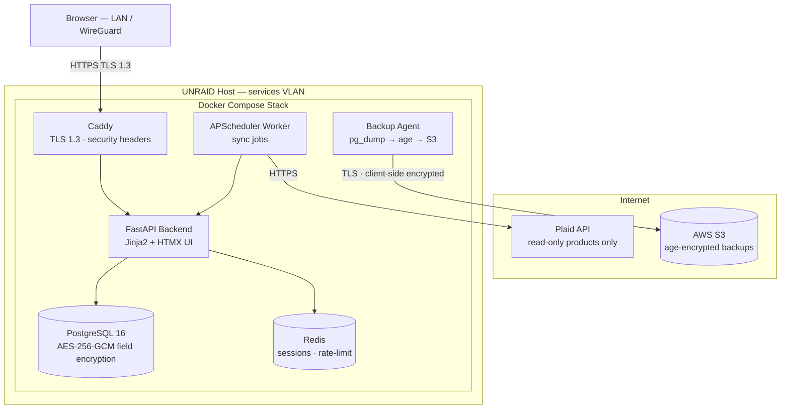
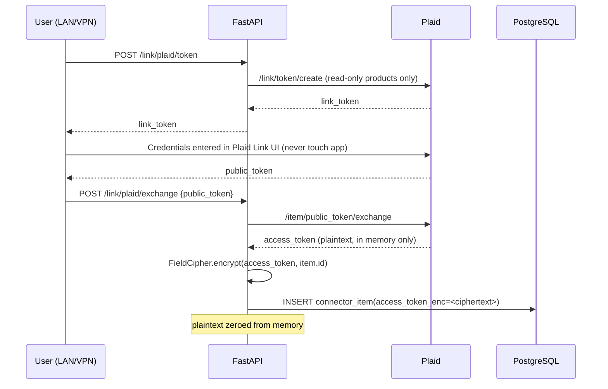
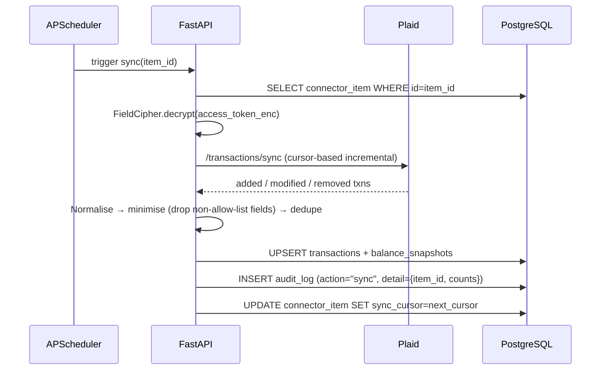
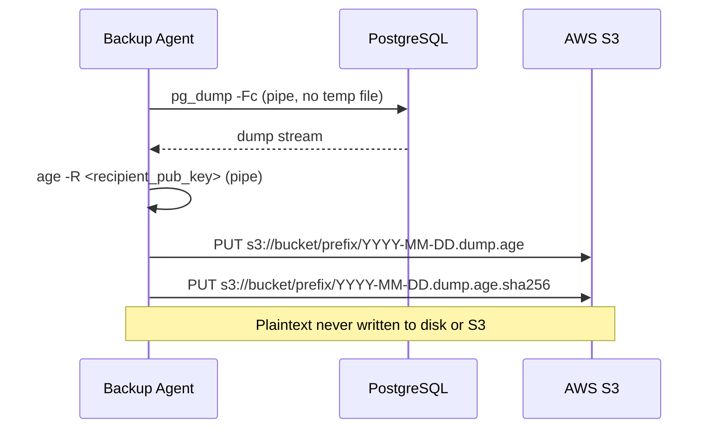
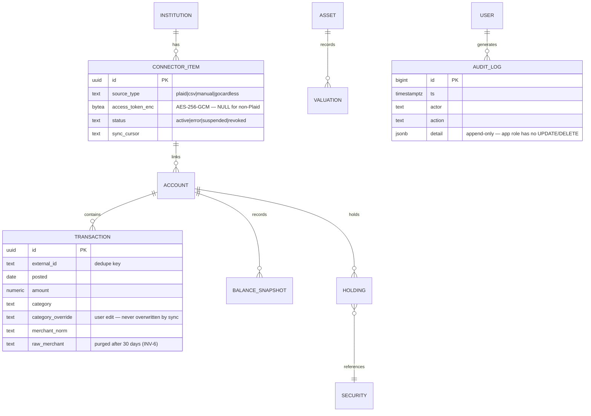

# ARCHITECTURE.md — The Sorcerer's Stone
**Project:** Secure Financial Central Planner Dashboard
**Owner:** Obsidian Forged Systems LLC (OFS)
**Status:** Living document — updated each phase
**Source of truth:** `.kiro/specs/phase-1-architecture/design.md`

> This document is a navigable summary. Detailed design decisions, enforcing controls for
> INV-1..6, and component interfaces live in the Kiro spec files under `.kiro/specs/`.

---

## 1. System Context

The Sorcerer's Stone runs entirely on a self-hosted UNRAID Docker host on a dedicated services
VLAN. AWS is used exclusively for client-side-encrypted backup storage. No authoritative financial
data ever leaves the UNRAID host in plaintext.

**Key constraints:**
- No WAN port-forward — access via LAN or WireGuard VPN only (INV-4)
- Plaid read-only products only: `transactions`, `investments`, `liabilities`, `balance` (INV-2)
- Plaintext financial data never leaves UNRAID — S3 objects are age-encrypted before upload (INV-1)

---

## 2. Component Overview

| Component | Technology | Key Responsibility |
|---|---|---|
| Reverse Proxy | Caddy 2 | TLS 1.3, HSTS, CSP, rate-limit on `/auth/login` |
| Backend API + UI | FastAPI 0.110+ / Python 3.12 | All routes, Jinja2 + HTMX templates |
| Database | PostgreSQL 16 | System of record; AES-256-GCM field encryption for tokens |
| Cache / Session Store | Redis 7 | Server-side sessions, rate-limit counters |
| Sync Worker | APScheduler (in-process) | Scheduled connector sync, maintenance jobs |
| Backup Agent | Python + age CLI + AWS CLI | Nightly encrypted pg_dump → S3 |

All custom containers run non-root (UID 1000), read-only rootfs, `cap_drop: ALL`,
`no-new-privileges: true`. Only Caddy publishes a host port.

---

## 3. Data Flow

### 3.1 Plaid Link & Token Storage

### 3.2 Scheduled Sync

### 3.3 Nightly Backup

---

## 4. Data Model (High-Level ERD)

**Privacy notes:**
- Account numbers stored as last-4 masked only
- No geolocation fields ingested from Plaid
- `raw_merchant` purged 30 days post-normalisation (configurable)
- `audit_log` is append-only: `REVOKE UPDATE, DELETE ON audit_log FROM app_role`

---

## 5. API Surface

| Endpoint | Method | Auth | Purpose |
|---|---|---|---|
| `/auth/login` | POST | — | Argon2id login → Redis session |
| `/auth/logout` | POST | ✅ | Invalidate session |
| `/dashboard` | GET | ✅ | Net worth overview, HTMX partials |
| `/accounts` | GET | ✅ | All accounts grouped by type |
| `/accounts/{id}` | GET | ✅ | Account detail + balance history |
| `/transactions` | GET | ✅ | Filterable, paginated |
| `/investments` | GET | ✅ | Holdings + allocation chart |
| `/link/plaid/token` | POST | ✅ | Create Plaid Link token |
| `/link/plaid/exchange` | POST | ✅ | Exchange public_token → encrypted access_token |
| `/link/plaid/{id}` | DELETE | ✅ | Revoke item + delete token |
| `/import/csv` | POST | ✅ | CSV/OFX upload + import |
| `/admin/sync/run` | POST | ✅ | Manual sync trigger |
| `/admin/backup/run` | POST | ✅ | Manual backup trigger |
| `/export` | GET | ✅ | Full data export (portability) |
| `/healthz` | GET | internal | Liveness — checks Postgres + Redis |
| `/metrics` | GET | internal | Prometheus text format |

---

## 6. Security Architecture Summary

Full enforcement controls: `.kiro/specs/phase-1-architecture/design.md §10`
Full controls matrix: `SECURITY.md §7`

| Invariant | One-Line Summary |
|---|---|
| INV-1 | Plaintext never leaves UNRAID; age-encrypted before S3 |
| INV-2 | Plaid read-only products only; no raw credentials in app |
| INV-3 | Tokens AES-256-GCM encrypted; key from Docker secret only |
| INV-4 | TLS 1.3 + auth middleware + Redis sessions; LAN/VPN only |
| INV-5 | Append-only audit_log; DB role cannot UPDATE/DELETE it |
| INV-6 | Pydantic allow-list drops unmapped fields; raw data purged |

---

## 7. Phase Delivery Map

| Phase | Scope | Architecture Impact |
|---|---|---|
| **1** ✅ | Requirements, HL architecture, core spec | This document; `.kiro/specs/phase-1-architecture/` |
| **2** | Data models, schema, FastAPI skeleton + auth | `app/models/`, `app/core/`, Alembic migrations |
| **3** | Plaid + CSV sync engine | `app/connectors/`, `app/services/sync_engine.py` |
| **4** | Dashboard UI core views | `app/templates/`, Chart.js endpoints |
| **5** | Net worth, budgets, goals, reports, export | `app/services/net_worth.py`, `/export` |
| **6** | UNRAID deployment + S3 backup lane | `infra/`, backup container, restore-verify |
| **7** | CI/CD hardening | `.github/workflows/`, ZAP scan, Kiro review gate |
| **8** | Monitoring + polish | Prometheus + Grafana, alert runbooks |
| **9** | Bedrock insights (optional) | Aggregates-only cloud inference; local Ollama first |

---

## 8. Decision Log Reference

Authoritative decision log: `PROJECT_SPEC.md §7`

| ID | Decision | Rationale |
|---|---|---|
| D-001 | UNRAID authoritative; AWS backup-only | Privacy, INV-1 |
| D-002 | Plaid read-only products only | Minimize blast radius, INV-2 |
| D-003 | Client-side age/AES-GCM encryption before S3 | INV-1, D-001 |
